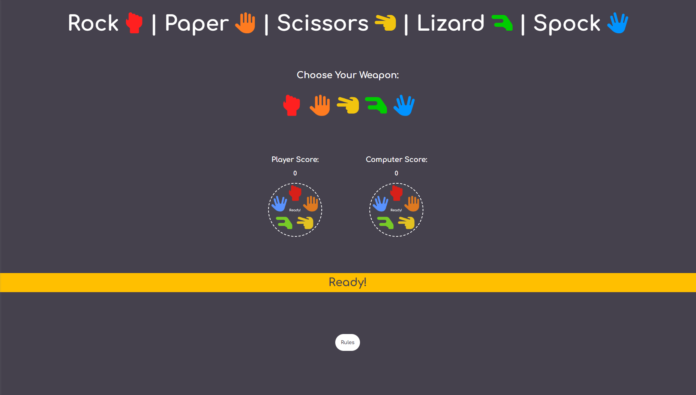
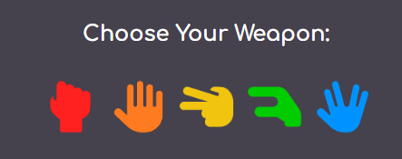
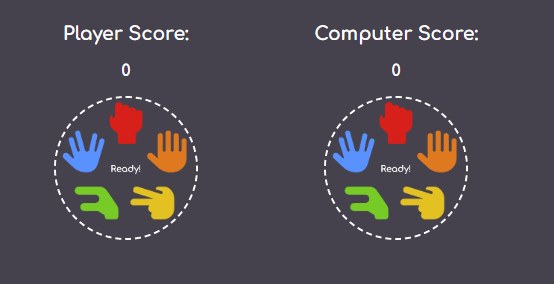
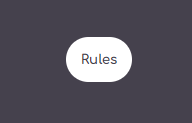
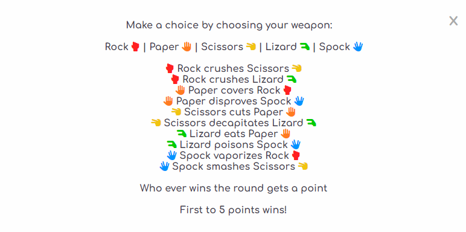

# Rock Paper Scissors Lizard Spock

## Table of contents
* [Features](#features)
* [Technologies](#technologies)
* [Testing](#testing)
* [Roadblocks and difficulties](#roadblocks-and-difficulties)
* [Bugs](#bugs)
* [Validator Testing](#validator-testing)
* [Deployment](#deployment)
* [Citations](#citations)

## Features
* Page Design
    - I have given the page a gray background with white writing to make the page easy to read.
    - I also wanted to add some color to the page so it doesn't look too boring so I decided to use color for the icon images.

* Title Area
    - I wanted the title to stand out so I decided to add the game icons alongside the text of each 'weapon'.

* Choice Area
    - Sticking with the colored theme - I have put the icons next to each other for the player to select, with a border appearing when the mouse is hovering over the icon - this makes it easy for the player to see which option is being selected.

* Game Area
    - 

* Results Area
    - 

* Rules Area
    - 

## Technologies
Project is created with:
* HTML
* CSS
* JavaScript

## Testing
* I have tested the game in Chrome, Firefox & Edge and confirm it is working in all 3 browsers.
* I confirm that the pages are responsive and functions correctly on all standard screen sizes using devtools.
* I confirm that all text on the site is easily readable and easy to understand.
* I confirm the game plays as it should:
    * User choice is chosen as per user selection and computer is chosen randomly. 
    * Game resets after either the player or computer reaches a score of 5.

## Roadblocks and difficulties

* Initially wanted to add a gradient background but could not get it to fit the full screen. Background would appear tiled.

## Bugs
- ### Solved bugs
    - ### Styling for smaller screens
        - Game area was showing in a column instead of a row.
        - Updated from a grid view to inline-block which reslved the issue.
    - ### Choice images did not reset when game reset
        - Images would stay as previous choice when game reset instead of going back to the starting "Ready" image.
        - After meeting with my mentor, Jubril Akolade, we discovered I was overcomplicating the JS and he helped me resolve the issue by using the same code as the page load (Thanks Jubril!)
    - ### No alt attributes for images
        - Lighthouse results were not good due to images not having alt attributes
        - After researching, found out how to add an alt attribute to an image created in JS.
- ### Unfixed bugs
    - No unfixed bugs

## Validator Testing
- ### HTML
    - No errors found when passing through the official W3C validator.
- ### CSS
    - No errors found when passing through the official (Jigsaw) validator.
- ### JavaScript
    - No major errors found when passing through JSHint.
- ### Accessibility
    - I can confirm that all text, fonts and colours are easily readable and accessible by running it through Lighthouse in devtools.

 

## Deployment

* This site has been deloyed to Github Pages:
    - Link can be found here - [Rock Paper Scissors Lizard Spock](https://sharjahmed.github.io/rock-paper-scissors-lizard-spock/)
    
## Citations 

* My fellow students for helping me understand the JS code for the gameplay.
* https://cssgradient.io/blog/how-to-create-a-gradient-background/ - used to try and understand how to create a gradient background - did not end up using.
* https://www.w3schools.com/js/js_htmldom_eventlistener.asp - to help me understand event listeners.
* https://www.w3schools.com/js/js_comments.asp - to help me understand commenting in JS.
* https://www.youtube.com/watch?v=AR2BOp_mfRU & https://www.youtube.com/watch?v=RwFeg0cEZvQ - to help me understand JS behind gameplay - ended up doing my game slightly different
* https://stackoverflow.com/questions/15471688/adding-alt-attribute-to-image-in-javascript - to help me understand how to add an alt attribute to an image created in JS.
* My brother for creating the game icon images and the ready image.
*My mentor, Jubril Akolade, for all his help and patience to help me smooth out and simplify my JS.