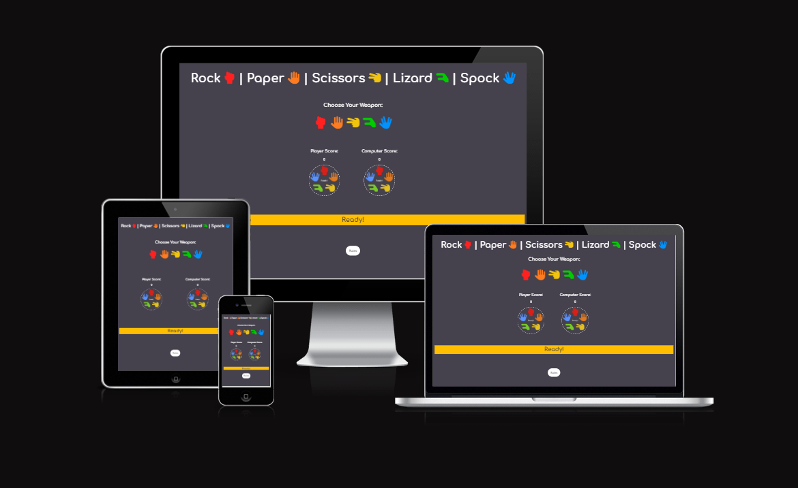

# Rock Paper Scissors Lizard Spock

(Developer: Sharj Ahmed)

[Live Webpage](https://sharjahmed.github.io/rock-paper-scissors-lizard-spock/)

Rock Paper Scissors Lizard Spock, like its well known and loved basic version - Rock Paper Scissors, is a classic game of chance!

The two new options - Lizard and Spock - add a whole new dimension to the gameplay. Play it to have some fun, or to help you make that important decision!

Kept bright and light hearted, this game is for all ages to enjoy and is super simple to play! The rules are easily accessed at the bottom of the page and the score is also easy to keep on top of in the middle of the page. 

Can you beat the computer to 5 points? Be the first to choose your weapon and find out! 

## Table of contents
* [Project Goals](#project-goals)
* [User Experience](#user-experience)
* [Design](#design)
* [Features](#features)
* [Technologies](#technologies)
* [Testing](#testing)
* [Roadblocks and difficulties](#roadblocks-and-difficulties)
* [Bugs](#bugs)
* [Validator Testing](#validator-testing)
* [Deployment](#deployment)
* [Credits](#credits)

## Project Goals
* User Goals
    - play a fun game of Rock Paper Scissors Lizard Spock.
    - Check the rules of the game whenever they wish to.
    - Easily choose their option to play against the computer.
    - Keep track of the scores in the current game.
    - Play again when player or computer reaches 5 points.
* Site Owner Goals
    - Make it easy for the player to understand how to play and to actually play the game.
    - Make the scores easily visible to the player.
    - Reset the game once player/computer reaches 5 points so the player can play again.
    - Make the gameplay experience fun to encourage revisits to the game. 

## User Experince
* Target Audience
    - This game is designed for anyone looking for a fun time passer.
    - Designed to keep all ages engaged.
* User Requrements and Expectations
    - A simple gameplay experience
    - The ability to choose rock, paper, scissors, lizard or spock.
    - Scores that are easily visible when playing.
    - An interactive and responsive page, regardless of what device they are on. 

## User Stories
* First-time Player
    1. As a first-time player, I want to be able to easily play a game of rock, paper, scissors, lizard, spock.
    2. As a first-time player, I want to be able to check the rules easily whenever I want.
    3. As a first-time player, I want to be able to check the score as I am playing the game.
    4. As a first-time player, I want to be able to be able to see what option the computer has chosen as I am playing the game.
* Returning Player
    1. As a returning player, I want to be able to play the game with as much enjoyment as the initial visit.
    2. As a returning player, I want to be able to re-check the rules. 
* Site Owner
    1. As the site owner, I want to be able to make the page well laid out so the player can easily navigate their way round.
    2. As the site owner, I want to be able to make it clear how to play, and how to check the rules.
    3. As the site owner, I want to make it clear what the scores are and who has won the game. 

## Design
* Color Scheme
    - The main decision for the color scheme chosen for the page is to make the page look appealing and clear for the player. 
    - I used a dark background with bright icons and a gold results bar.
* Fonts
    - I wanted to use a font that was easy to read but also looked fun.
    - I decided to use Comfortaa from Google Fonts
    
    

## Features
* Page Design
    - I have given the page a gray background with white writing to make the page easy to read.
    - I also wanted to add some color to the page so it doesn't look too boring so I decided to use color for the icon images.
    - I decided to keep the page quite simple, so it doesn't look too busy, which I personally prefer.

* Title Area
    - I wanted the title to stand out so I decided to add the game icons alongside the text of each 'weapon'.

* Choice Area
    - I decided to stick with the colored theme to make the site consistant.
    - In keeping with the simple page design, the game choice icons are laid out horizontally.
    - A border appears over the icon when the mouse is hovering over to make it easy for the player to see which option is being selected.

* Game Area
    - The game starts with a "ready" image, to make it clear to the player that we are ready to start the game.
    - The image updates as the player chooses, to the players' chosen weapon and the randomly selected, computer choice.
    - This updates with each click.
    - Once the game is over (when either the player or computer reaches a score of 5), the images reset to the "ready" image.

* Results Area
    - Continuing the "ready" theme at the beginning of the game, the results banner starts with a "ready" message.
    - I wanted the results area to stand out on the page, so I decided to give the banner a gold color, which contrasts to the gray background.
    - As the player chooses, the message in the banner changes to inform the player of the outcome of that round - (if player chooses rock, and computer chooses paper - "You Lose! Paper Covers Rock!" will show etc.)
    - I made this decision as it keeps the game more engaging, as if the player is like myself, and doesn't know the rules by heart, this makes it easy to understand who won the round and why, without having to click on the rules button frequently to check.

* Rules Area
    - I decided to place the rules area hidden until the rules button is clicked.
    - This keeps in theme with the simple layout of the page, as I found having the rules listed out visible perminantly made the page look a lot messier.
    - Rules appear once the rules button is clicked on.
    - Once again, to keep things simple for the player, I have decided to list the rules out in order of rock -> paper -> scissors -> lizard -> spock.
    - I have also clarified the criteria on how to win the game - first to 5 points wins!

## Technologies
Project is created with:
* HTML
* CSS
* JavaScript

## Testing
* I have tested the game in Chrome, Firefox & Edge and confirm it is working in all 3 browsers.
* I confirm that the pages are responsive and functions correctly on all standard screen sizes using devtools.
* I confirm that all text on the site is easily readable and easy to understand.
* I confirm the game plays as it should:
    * Player choice is chosen as per player selection and computer is chosen randomly. 
    * Game resets after either the player or computer reaches a score of 5.

## Roadblocks and difficulties

* Initially wanted to add a gradient background but could not get it to fit the full screen. Background would appear tiled.
* I wanted the colors for the choice images to invert when hovering, but had to make a border appear instead, as it did not work as I wanted it to.

## Bugs
- ### Solved bugs
    - ### Styling for smaller screens
        - Game area was showing in a column instead of a row.
        - Updated from a grid view to inline-block which reslved the issue.
    - ### Choice images did not reset when game reset
        - Images would stay as previous choice when game reset instead of going back to the starting "Ready" image.
        - After meeting with my mentor, Jubril Akolade, we discovered I was overcomplicating the JS and he helped me resolve the issue by using the same code as the page load (Thanks Jubril!)
    - ### No alt attributes for images
        - Lighthouse and JSHint results were not good due to images not having alt attributes.
        - After researching, found out how to add an alt attribute to an image created in JS (via [stackoverflow.com](https://stackoverflow.com/questions/15471688/adding-alt-attribute-to-image-in-javascript)).
- ### Unfixed bugs
    - No unfixed bugs

## Validator Testing
- ### HTML
    - No errors found when passing through the official W3C validator.
- ### CSS
    - No errors found when passing through the official (Jigsaw) validator.
- ### JavaScript
    - No errors found when passing through JSHint.
- ### Accessibility
    - I can confirm that all text, fonts and colours are easily readable and accessible by running it through Lighthouse in devtools.

 

## Deployment

* This site has been deloyed to Github Pages:
    
## Credits 

* My fellow students for helping me understand the JS code for the gameplay.
* https://cssgradient.io/blog/how-to-create-a-gradient-background/ - used to try and understand how to create a gradient background - did not end up using.
* https://www.w3schools.com/js/js_htmldom_eventlistener.asp - to help me understand event listeners.
* https://www.w3schools.com/js/js_comments.asp - to help me understand commenting in JS.
* https://www.youtube.com/watch?v=AR2BOp_mfRU & https://www.youtube.com/watch?v=RwFeg0cEZvQ - to help me understand JS behind gameplay - ended up doing my game slightly different
* https://stackoverflow.com/questions/15471688/adding-alt-attribute-to-image-in-javascript - to help me understand how to add an alt attribute to an image created in JS.
* https://www.youtube.com/watch?v=GsFyCuD62n4 - to help me understand how to code Sweet Alerts into my site.
* My brother for creating the game icon images and the ready image.
*My mentor, Jubril Akolade, for all his help and patience to help me smooth out and simplify my JS.
