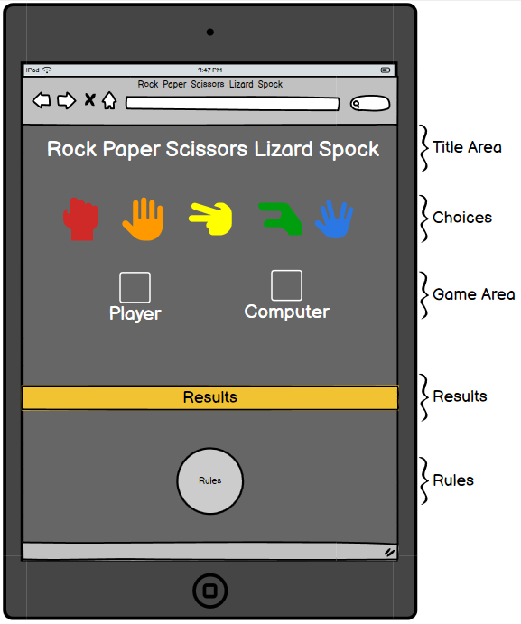
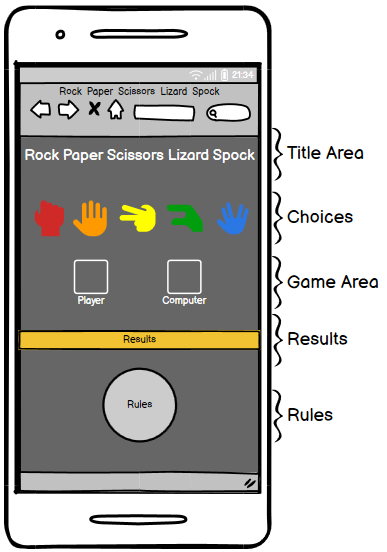
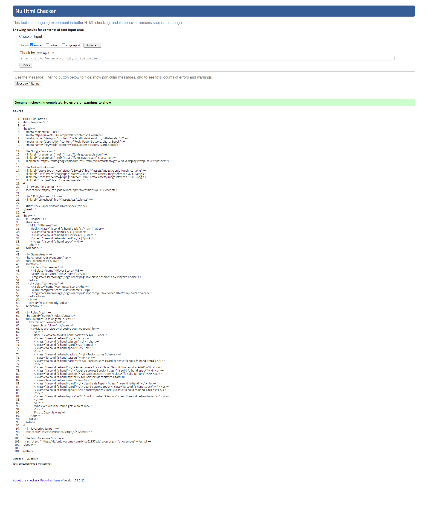
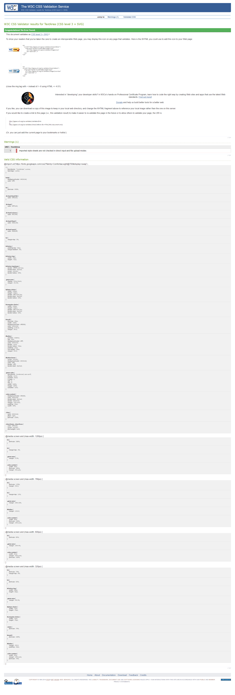
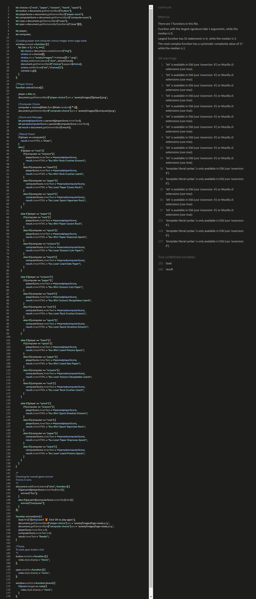
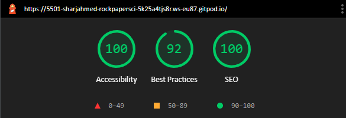

# Rock Paper Scissors Lizard Spock

(Developer: Sharj Ahmed)

[Live Webpage](https://sharjahmed.github.io/rock-paper-scissors-lizard-spock/)

Rock Paper Scissors Lizard Spock, like its well-known and loved basic version - Rock Paper Scissors, is a classic game of chance!

The two new options - Lizard and Spock - add a whole new dimension to the gameplay. Play it to have some fun, or to help you make that important decision!

Kept bright and light-hearted, this game is for all ages to enjoy and is super simple to play! The rules are easily accessed at the bottom of the page and the score is also easy to keep on top of in the middle of the page. 

Can you beat the computer to 5 points? Be the first to choose your weapon and find out! 

## Table of contents
* [Project Goals](#project-goals)
* [User Experience](#user-experience)
* [Design](#design)
* [Features](#features)
* [Technologies](#technologies)
* [Testing](#testing)
* [Validator Testing](#validator-testing)
* [Deployment](#deployment)
* [Credits](#credits)

## Project Goals
* User Goals
    - play a fun game of Rock Paper Scissors Lizard Spock.
    - Check the rules of the game whenever they wish to.
    - Easily choose their option to play against the computer.
    - Keep track of the scores in the current game.
    - Play again when the player or computer reaches 5 points.
* Site Owner Goals
    - Make it easy for the player to understand how to play the game.
    - Make the scores easily visible to the player.
    - Reset the game once the player/computer reaches 5 points so the player can play again.
    - Make the gameplay experience fun to encourage revisits to the game. 

## User Experience
* Target Audience
    - This game is designed for anyone looking for a fun time passer.
    - Designed to keep all ages engaged.
* User Requirements and Expectations
    - A simple gameplay experience
    - The ability to choose rock, paper, scissors, lizard, or Spock.
    - Scores that are easily visible when playing.
    - An interactive and responsive page, regardless of what device they are on. 

## User Stories
* First-time Player
    1. As a first-time player, I want to be able to easily play a game of rock, paper, scissors, lizard, Spock.
    2. As a first-time player, I want to be able to check the rules easily whenever I want.
    3. As a first-time player, I want to be able to check the score as I am playing the game.
    4. As a first-time player, I want to be able to see what option the computer has chosen as I am playing the game.
* Returning Player
    1. As a returning player, I want to be able to play the game with as much enjoyment as the initial visit.
    2. As a returning player, I want to be able to re-check the rules. 
* Site Owner
    1. As the site owner, I want to be able to make the page well laid out so the player can easily navigate their way around.
    2. As the site owner, I want to be able to make it clear how to play, and how to check the rules.
    3. As the site owner, I want to make it clear what the scores are and who has won the game. 

## Design
* Color Scheme
    - The main decision for the color scheme chosen for the page is to make the page look appealing and clear for the player. 
    - I used a dark background with bright icons and a gold results bar.

* Fonts
    - I wanted to use a font that was easy to read but also looked fun.
    - I decided to use Comfortaa from [Google Fonts](https://fonts.google.com/specimen/Comfortaa/about?query=comfortaa) (Designed by [Johan Aakerlund](https://www.deviantart.com/aajohan/art/Comfortaa-font-105395949)) as I feel the rounded style gives a fun feel but is also easy to read.
        
    

* Structure
    - The page has been structured so that everything appears without the need to scroll up or down - all features appear on the one page in front of the player.
    - This makes the page user-friendly and easy to navigate. 
    - The title is at the top of the page with the game choices underneath.
    - The middle of the page has the game area where the player can see their score and choice, along with the computer's score and choice.
    - The gold banner shows the result after each round.
    - At the bottom of the page is the rules button, which when clicked on, brings up the rules of the game.

* Wireframes
    

Desktop Wireframe

    
    

    

Tablet Wireframe

    
    

    

Mobile Wireframe

    
    

        
   
## Features
* Title Area
    - I wanted the title to stand out so I decided to add the game icons alongside the text of each 'weapon'.

* Choice Area
    - I decided to stick with the colored theme to make the site consistent.
    - In keeping with the simple page design, the game choice icons are laid out horizontally.
    - A border appears over the icon when the mouse is hovering over it to make it easy for the player to see which option is being selected.

* Game Area
    - The game starts with a "ready" image, to make it clear to the player that we are ready to start the game.
    - The image updates as the player chooses, to the player's chosen weapon and the randomly selected, computer choice.
    - This updates with each click.
    - Once the game is over (when either the player or computer reaches a score of 5), the images reset to the "ready" image.

* Results Area
    - Continuing the "ready" theme at the beginning of the game, the results banner starts with a "ready" message.
    - I wanted the results area to stand out on the page, so I decided to give the banner a gold color, which contrasts with the gray background.
    - As the player chooses, the message in the banner changes to inform the player of the outcome of that round - (if the player chooses rock, and the computer chooses paper - "You Lose! Paper Covers Rock!" will show, etc.)
    - I made this decision as it keeps the game more engaging, as if the player is like myself, and doesn't know the rules by heart, this makes it easy to understand who won the round and why without having to click on the rules button frequently to check.

* Rules Area
    - I decided to place the rules area hidden until the rules button is clicked.
    - This keeps in theme with the simple layout of the page, as I found having the rules listed out visible permanently made the page look a lot messier.
    - Rules appear once the rules button is clicked on.
    - Once again, to keep things simple for the player, I have decided to list the rules out in order of rock -> paper -> scissors -> lizard -> Spock.
    - I have also clarified the criteria on how to win the game - the first to 5 points wins!

## Technologies
The project is created with:
* Languages
    - HTML
    - CSS
    - JavaScript

* Libraries Used 
    - [Google Fonts](https://fonts.google.com/)
        - Site font Comfortaa was taken from Google Fonts
    - [Font Awesome](https://fontawesome.com/)
        - All icons used were from Font Awesome
    - [Git](https://git-scm.com/)
        - Git was used for version control by utilizing the Gitpod terminal to commit to Git and Push to GitHub.
    - [GitHub](https://github.com/):
        - GitHub is used to store the project's code after being pushed from Git.
    - [Balsamiq](https://balsamiq.com/):
        - Balsamiq was used to create the wireframes during the design process.

## Testing
* Browser Testing:
    - The site has been tested in the following browsers:
        - Google Chrome
        - Mozilla Firefox
        - Microsoft Edge
* Device Testing:
    - I have tested the site on the following devices:
        - Dell Latitude 7390 Laptop
        - Apple iPad Mini 4
        - OnePlus 10 Pro 5G
* I confirm that the pages are responsive and function correctly on all standard screen sizes using devtools and device testing as above.
* I confirm that all text on the site is easily readable and easy to understand.
* I confirm the game plays as it should:
    * Player choice is chosen as per player selection and the computer is chosen randomly. 
    * Game resets after either the player or computer reaches a score of 5.

## Validator Testing
* Validator testing was done to ensure there are no syntax errors with the code:

HTML

No errors were found when passing through the official W3C validator.

CSS

No errors were found when passing through the official (Jigsaw) validator.

JavaScript

No errors found when passing through JSHint.

Lighthouse

Lighthouse in Google Chrome Developer Tools was used to test the performance and accessibility of the website.

    
Desktop

    
    
Mobile

    

### Testing User Stories from User Experience Section
1. First-Time Player Goals:
    * As a first-time player, I want to be able to easily navigate the page to view the game rules.
        - Upon loading the site, players are met with a clean page with a clear layout.
        - It is clear to see the 'Rules' button at the bottom of the page, when clicked on, the rules appear clearly in the center of the screen.
        - Rules are set out in an easy-to-read manner, with the use of icons to aid in making the rules simple to understand for first-time players.
    * As a first-time player, I want to clearly see how to play the game.
        - The game area is clearly placed in the center of the screen.
        - The choice section, headed with "Choose You Weapon" is easy to find, with the colorful icons placed directly below.
        - A border appears over the icon when hovering the mouse over, making it clear to the player to see which option they are selecting.
    * As a first-time player, I want to be able to see the score as I am playing the game and to see who wins the overall game.
        - The scores area is placed directly below the choices with the Player & Computer scores labeled clearly. 
        - The images update to show the Player & Computer choice when the Player chooses their option and the scores update based on the Player & Computer choice.
        - Upon reaching a score of 5, either the Player or the Computer will win. When this happens the Player is met with a pop-up alert stating who has won with a medal emoji. 
    * As a first-time player, I want to be able to clearly see the outcome of the round when I'm playing.
        - Below the scores area is the results area.
        - The golden banner stands out clearly, and updates to show who has won and why taking the wording from the rules.

2. Returning Player Goals:
    * As a returning player, I want to remind myself of the rules.
        - As was the player's experience the first time around, the 'Rules' button is clearly visible at the bottom of the page to be able to click on and check on the game rules.
    * As a returning player, I want to be able to replay the game.
        - With an interactive and simple interface, the site makes it easy to enjoy the game and pass time. Sure to engage any returning player into killing a bit of time with a few games of rock, paper, scissors, lizard, Spock!

3. Site Owner:
    * As the site owner, I want to provide a user-friendly interface and enjoyable experience.
        - The game uses a bold color palette to really make certain areas of the game stand out. This makes the game easy to understand, which in turn provides the player with an enjoyable experience on the site.
        - Providing a clear area for the rules will ensure that players remain engaged as they can check back at any time to refresh themselves on the rules between rounds.
        - The results banner also explains the outcome for each round, explaining who has won and why.

### Bugs
- Solved bugs
    - Styling for smaller screens
        - Game area was showing in a column instead of a row.
        - Updated from a grid view to inline-block which resolved the issue.
    - Choice images did not reset when the game reset
        - Images would stay as the previous choice when the game reset instead of going back to the starting "Ready" image.
        - After meeting with my mentor, Jubril Akolade, we discovered I was overcomplicating the JS and he helped me resolve the issue by using the same code as the page load (Thanks Jubril!)
    - No alt attributes for images
        - Lighthouse and JSHint results were not good due to images not having alt attributes.
        - After researching, found out how to add an alt attribute to an image created in JS (via [stackoverflow.com](https://stackoverflow.com/questions/15471688/adding-alt-attribute-to-image-in-javascript)).
- Unfixed bugs
    - No unfixed bugs

## Deployment

* This site has been deployed to GitHub Pages, by following these steps:
    1. Log in to GitHub and locate the GitHub Repository
    2. In the top menu of the Repository, locate the "Settings" Button on the menu.
    3. Scroll down the Settings page until you locate the "GitHub Pages" Section.
    4. Under "Source", click the dropdown called "None" and select "Master Branch".
    5. Press Save
    6. Scroll back down through the page to locate the now published [site link](https://sharjahmed.github.io/rock-paper-scissors-lizard-spock/) in the "GitHub Pages" section.

* Forking the GitHub repository:
    1. Go to the GitHub repository
    2. Click the fork icon in the top right-hand of the page.
    3. Click create fork.

* You can clone the repository by following these steps:
    1. Go to the GitHub repository
    2. Click the 'Code' button to reveal the dropdown menu.
    3. Select either HTTPS, SSH, or Github CLI and click the copy button.
    4. Open Git Bash
    5. Change the current working directory to the location where you want the cloned directory to be made.
    6. Type git clone, and then paste the URL you copied in Step 3. 
        - git clone https://github.com/YOUR-USERNAME/YOUR-REPOSITORY
    7. Press Enter to create your local clone.
    
## Credits 

* My fellow students for helping me understand the JS code for the gameplay.
* https://cssgradient.io/blog/how-to-create-a-gradient-background/ - used to try and understand how to create a gradient background - did not end up using.
* https://www.w3schools.com/js/js_htmldom_eventlistener.asp - to help me understand event listeners.
* https://www.w3schools.com/js/js_comments.asp - to help me understand commenting in JS.
* https://www.youtube.com/watch?v=AR2BOp_mfRU & https://www.youtube.com/watch?v=RwFeg0cEZvQ - to help me understand JS behind gameplay - ended up doing my game slightly different
* https://stackoverflow.com/questions/15471688/adding-alt-attribute-to-image-in-javascript - to help me understand how to add an alt attribute to an image created in JS.
* https://www.youtube.com/watch?v=GsFyCuD62n4 - to help me understand how to code Sweet Alerts into my site.
* My brother for creating the game icon images and the ready image.
*My mentor, Jubril Akolade, for all his help and patience in helping me smooth out and simplify my JS.